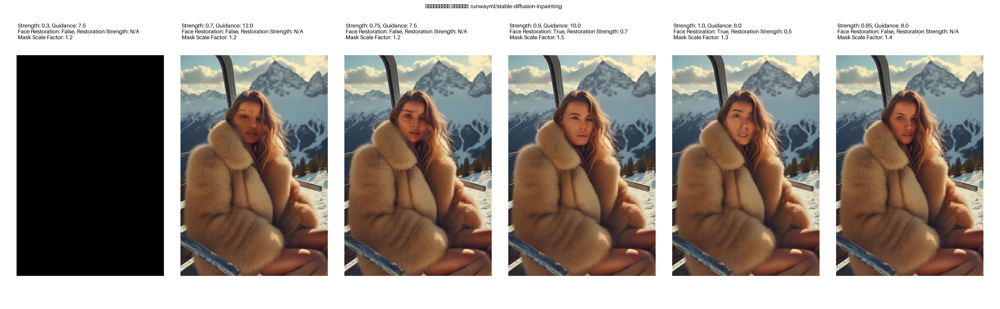
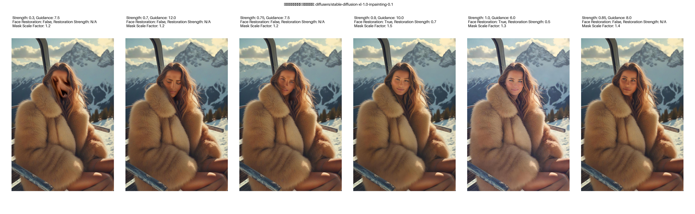
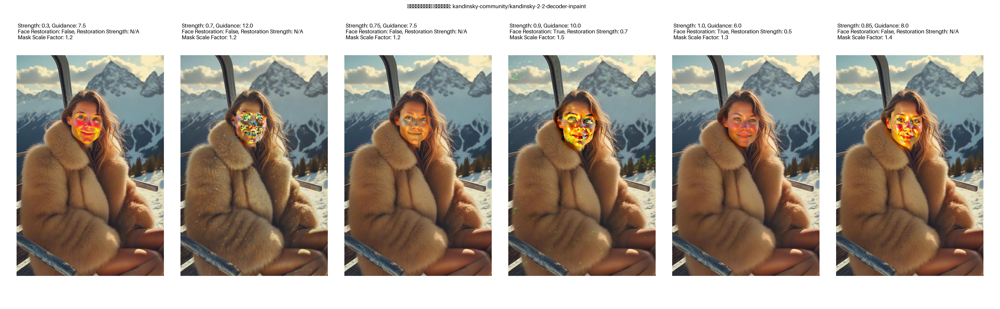
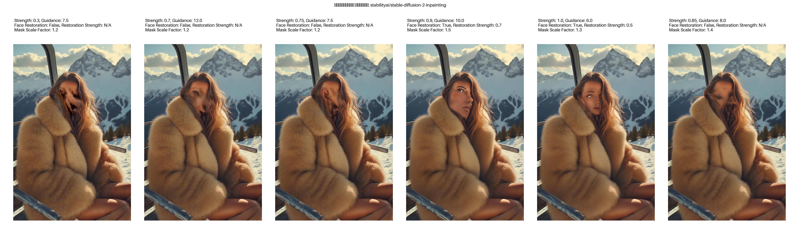
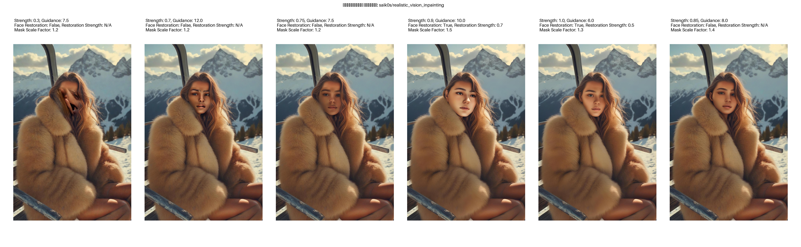
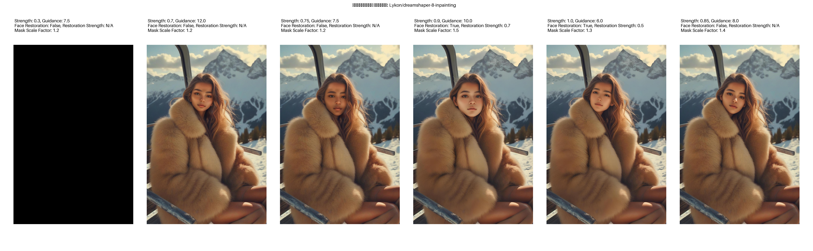

# Face Swap with Diffusion Models

## 📌 Описание проекта
Проект **"Face Swap with Diffusion Models"** использует диффузионные модели для замены лиц и инпейнтинга изображений. В основе лежит нейросетевой подход, позволяющий естественно встраивать замененные лица, сохраняя реалистичность и согласованность с окружающей сценой.

### 🔧 Основные компоненты:
- 🚀 **CodeFormer** – модель восстановления деталей лица.
- 🎨 **Diffusers** – библиотека для генерации изображений с помощью диффузионных моделей.
- 🌐 **Streamlit UI** – веб-интерфейс для удобного тестирования модели.
- 🧪 **Тестовый модуль** – набор скриптов для автоматической проверки качества работы алгоритмов.

### 📚 Документация и исследования
Немного слышал про SD3 и подобные вещи, но глубоко не влезал, спасибо за идеи для ресёрча:). 
Постарался выжать максимум из того, что есть в открытом доступе. Оценил существующие решения.
Подробный обзор технологий, использованных в проекте, доступен в [📄 minds/RESEARCH.md](minds/RESEARCH.md).

Решил не копать в ретрейн эмбеддингов для тюна моделей, а продолжить концепт в большей степени алгоритмический. 
В общих чертах расписал [📄 тут](minds/CORE.md).

---

## 🖼️ Примеры результатов
На изображениях ниже показаны результаты работы модели при разных параметрах:

### Референс
| Reference | Target |
|-----------|--------|
| /IMG_0738.jpg) |  |

### 🎭 RunwayML Stable Diffusion Inpainting


### 🏆 Stable Diffusion XL 1.0 Inpainting


### 🖼 Kandinsky 2-2 Decoder Inpaint


### 🔵 StabilityAI Stable Diffusion 2 Inpainting


### 🔶 Saik0s Realistic Vision Inpainting


### 🌈 Lykon Dreamshaper 8 Inpainting



---

## 🎥 Пример использования Streamlit UI


---

## 🛠️ Технологический стек
Проект использует следующие технологии:
- 🐍 **Python 3.10+** – основной язык разработки
- 🧠 **Hugging Face Diffusers** – генерация изображений
- 📸 **OpenCV** – работа с изображениями
- 🔥 **PyTorch** – машинное обучение
- 🎭 **CodeFormer** – восстановление лиц
- 🖥️ **Streamlit** – веб-интерфейс
- 🛠️ **pytest** – тестирование

---

## 🚀 Установка и настройка
### 1️⃣ Клонирование репозитория
```bash
git clone https://github.com/vadim-voloshchuk/Face-Swap-with-Diffusion-Models.git
cd Face-Swap-with-Diffusion-Models
```

### 2️⃣ Установка зависимостей
```bash
python -m venv fssdf
source fssdf/bin/activate  # для Linux/Mac
# или
fssdf\Scripts\activate  # для Windows

pip install -r requirements.txt
```

### 3️⃣ Запуск Streamlit-интерфейса
```bash
streamlit run app.py
```

После запуска откройте [🌍 http://localhost:8501](http://localhost:8501) в браузере.

---

## 📡 Использование API
### 🔄 1. Замена лица
```python
from modules.face_composite import swap_face

result_image = swap_face("input.jpg", "target.jpg")
result_image.save("output.jpg")
```

### 🎨 2. Инпейнтинг изображения
```python
from modules.inpainting import run_inpainting

result_image = run_inpainting("input.jpg", "mask.jpg", "model_name", steps=50, padding_mask_crop=10)
result_image.save("output.jpg")
```

---

## ✅ Тестирование
Перед запуском тестов убедитесь, что активирована виртуальная среда:
```bash
source fssdf/bin/activate  # для Linux/Mac
# или
fssdf\Scripts\activate  # для Windows
```
Запустите тесты:
```bash
pytest tests/
```

---

Старался следовать требованиям к качеству. Много вещей не смог доработать ввиду отсутствия времени. Если у вас есть предложения или ошибки, создавайте **issue** в репозитории или пишите в дискуссию.

🚀 **Надеюсь на фидбек!** 🔥
