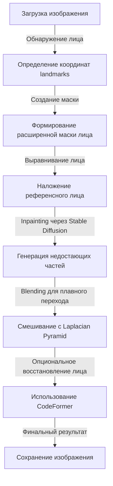

# 🧠 Алгоритм Face Swap & Inpainting

## 🔍 Описание
Этот алгоритм выполняет замену лица на изображении с использованием диффузионных моделей и дополнительных обработок для повышения качества. Включает в себя несколько этапов:

1️⃣ **Обнаружение лиц** – используем `dlib` для поиска лиц и извлечения ключевых точек.
2️⃣ **Создание маски лица** – расширяем область маски для генерации фона.
3️⃣ **Композиция лиц** – выравниваем и заменяем лицо перед обработкой.
4️⃣ **Inpainting (восстановление изображения)** – выполняем генерацию недостающих частей.
5️⃣ **Blending (смешивание изображений)** – многополосное смешивание для плавного перехода.
6️⃣ **Face Restoration (восстановление лица)** – использование CodeFormer для финальной обработки.

---

## 🎯 Что удалось реализовать
✅ **Онлайн-подход без обучения** – удалось обойтись без долгого этапа тренировки моделей.
✅ **Отказ от ArcFace** – решил использовать доступные open-source инструменты для композитинга.
✅ **Гибкая работа с разными моделями inpainting** – качество результата сильно зависит от выбора модели.

💡 _Наибольшее влияние на финальный результат оказывает inpainting-модель, поэтому важно экспериментировать с её параметрами._

---

## 📦 Использованные технологии
- **Python 3.10+** – основной язык.
- **Pillow** – обработка изображений.
- **OpenCV** – фильтры и морфологические операции.
- **NumPy** – численные вычисления.
- **dlib** – обнаружение лиц и landmarks.
- **Stable Diffusion** – генерация изображения.
- **AutoPipelineForInpainting** – унифицированный inpainting API.
- **Laplacian Blending** – техника смешивания изображений.

---

## 📌 Подробный алгоритм (Mermaid Diagram)


---

## 🚀 Основные функции

### 📌 Inpainting с учетом landmark'ов
```python
result_image = run_inpainting(
    target_img="target.jpg",
    ref_img="reference.jpg",
    strength=0.75,
    guidance_scale=7.5,
    steps=50,
    padding_mask_crop=10,
    model_name="stabilityai/stable-diffusion-inpainting",
    use_blending=True,
    use_face_restoration=True,
    restoration_strength=0.6,
    mask_scale_factor=1.2
)
result_image.save("output.jpg")
```

### 📌 Детектирование лица и его ключевых точек
```python
from modules.face_detection import detect_face

face_coords, face_img = detect_face("target.jpg")
```

### 📌 Создание маски лица с расширением
```python
from modules.masking import create_expanded_face_mask
mask = create_expanded_face_mask(image_shape, landmarks, scale_factor=1.2)
```

### 📌 Композитинг лица (совмещение изображений)
```python
from modules.face_composite import composite_face_aligned

composite = composite_face_aligned(target_cv, ref_cv, predictor_path="shape_predictor_68_face_landmarks.dat")
```

### 📌 Blending с Laplacian Pyramid
```python
from modules.utils import laplacian_blending
blended_image = laplacian_blending(result_np, composite_np, mask_np, levels=5)
```

---

## 📌 Полный пайплайн алгоритма
1️⃣ **Загрузка изображения и обнаружение лица**
2️⃣ **Получение ключевых точек и создание маски**
3️⃣ **Выравнивание и наложение лица**
4️⃣ **Запуск модели inpainting через `AutoPipelineForInpainting`**
5️⃣ **Применение Laplacian Blending для сглаживания краев**
6️⃣ **Опциональное восстановление лица с CodeFormer**

💡 _Алгоритм позволяет гибко настраивать параметры для получения наилучшего качества._

---

## 📖 Дополнительные материалы
- [Исследование технологии](../minds/RESEARCH.md)
- [Основной README](../README.md)

🚀 **Разработано для максимального качества!** 🔥
